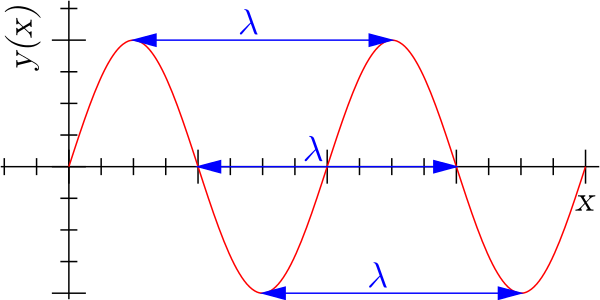
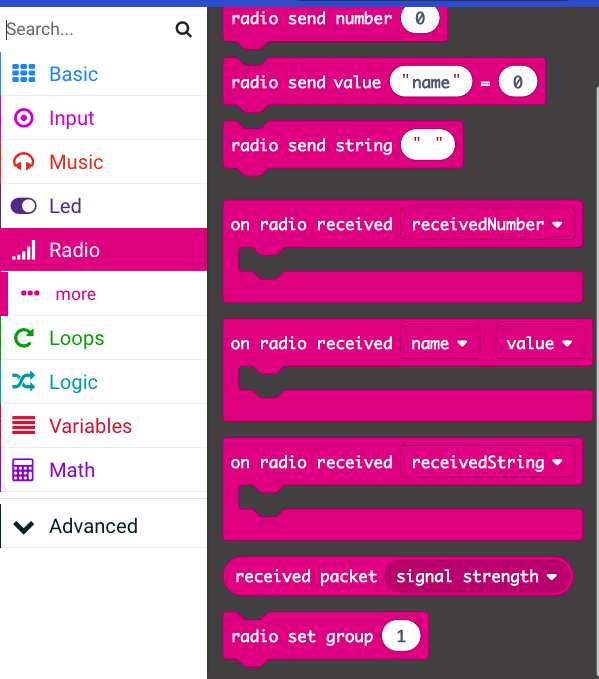

Broadcast communication: One to All
===================================

Introduction
------------

Wireless (radio) communication, for example WiFi and mobile phones, is a
popular way to connect to the Internet. In [Communication over Wires](../wiredcommunication), you
connected two micro:bits via wires. In this chapter, you will connect
your micro:bits using radios.

Doing this, you will not only learn how to use your micro:bit’s radio
but also, broadcast communication. Wireless communication is typically
broadcast: one micro:bit can send messages to all micro:bits. In
summary, this chapter covers:

- *wireless* communication and how to configure the micro:bit radio

- the concept of *broadcast* and *broadcast address*

- receiving and sending different message types (for example, a number
    or a string) using broadcast

- when broadcast is useful, and when it isn’t

### What you’ll need

    2 micro:bits
    2 battery holders, and 4 AAA batteries
    1 teammate

Background
----------

Wireless communication uses electromagnetic radiation - radio waves and
microwaves - to send information. Radio waves are essentially
electromagnetic waves radiating from an antenna (like the antennas of a
WiFi router). So, wireless communication is always broadcast. In other
words, the signals from the WiFi routers can be heard by other WiFi
devices tuned into the same radio frequency. Read more about frequency
in the Further Reading section at the end.

*Definition 1* \[Broadcast\] In networking, broadcast communication means the message
of a single sender is transmitted to all receivers in a network.

But, does this mean that broadcast is only possible with wireless
communications? No, but it is more cumbersome. For instance, in wired
communication, broadcast is possible by repeating the same message over
all the wires.

Finally, receivers may refuse to receive broadcast messages if they are
not labeled with a *broadcast address*.

*Definition 2* \[Broadcast address\] A broadcast address is a special address which
says all devices in the network should receive this message.

In a micro:bit, the broadcast address can be configured by setting the
group ID of micro:bit’s radio. All the micro:bits need to have the same
group ID for the broadcast to work. You will experiment with
broadcasting with micro:bits in the next section.

### Further reading

Let’s look at wireless communication in a bit more detail. You already
learned that radio waves are essentially electromagnetic waves.
Scientists have found that electromagnetic waves can be arranged
together on a scale called electromagnetic spectrum. The figure below
shows the electromagnetic spectrum, and the different electromagnetic
waves [^1].

One thing to notice in the figure that radio waves are within the
frequencies 30 KHz and 300 GHz in the electromagnetic spectrum. Radio
waves include microwaves, which have frequencies between 300 MHz and
300 GHz. Radio waves travel fast - they move at the speed of light, which
is around 300,000 km per second!

Let’s define frequency more formally. The frequency of a wave is the
number of waves passing a point in one second. The unit of frequency is
hertz (Hz) . Like the examples above, you will typically see that
frequencies are given as megahertz (MHz) or gigahertz (GHz). 1 MHz is
equal to 1 million (10^6) Hz. 1 GHz is equal to 1 billion (10^9) Hz.
Your micro:bit’s radio operates in the frequency range of 2402 MHz to
2480 MHz. What other wireless technologies operate in the same range as
the micro:bit’s radio? **Hint: The resources section at the end of this
chapter may be useful to answer this question.**

In addition to frequency, another important parameter of electromagnetic
waves is wavelength. The wavelength of a wave is the distance between a
point on the wave and the same point on the next wave. The unit of
wavelength is meters. The figure below shows an example of a
wavelength[^2].

Frequency and wavelength are related. The relationship between frequency
and wavelength is given by a formula: 

wavelength (meter) = Speed of light (meter/second)/Frequency (hertz)  

From this equation, we
see that the higher the frequency, the shorter the wavelength. You can
see this also in the spectrum figure. How long do you think your
micro:bit’s radio waves are?

Programming: Receiving and sending broadcast messages
-----------------------------------------------------

In this activity, you will learn how you can receive a message from a
broadcasting micro:bit. Also, you will send broadcast messages yourself.

If you are running this activity with your teacher in a classroom, your
teacher’s micro:bit will be the broadcast sender and you will try to
receive from this micro:bit.

If you are running this activity alone or with a friend, you can find
the example codes for the broadcasting micro:bit in this folder. You can use these examples to test your receiver
code by downloading it to a second micro:bit. These files will run on
your micro:bits, but you will not be able to display the code using
the JavaScript Blocks editor.

You will complete three tasks to experiment with broadcasting:

### Task 1: Configure your radio

**Description:** For broadcast communication, you need all your
micro:bits to have the same radio group ID. This group ID will be the
broadcast address. This is like tuning into the correct channel to
receive a TV broadcast.

**Instruction:** Program your receiver micro:bit’s group ID to 0. This
is the group ID used in the example broadcast sender programs [^3]. For
this, use the code block for setting the radio group in the JavaScript Blocks editor. It’s under
the Radio menu, as shown in the figure below. You can
learn about the radio blocks in more detail at
<https://makecode.microbit.org/reference/radio>.

### Task 2: Receive a broadcast message

**Description:** In this task, you will program your micro:bits to
receive a message from a broadcasting micro:bit. You will use the example
broadcast sender programs to test your receiver program.

When writing your receiver programs, there are two questions you need to
think about.

1. Which blocks in the JavaScript Blocks editor do you need to use to receive a radio message?

2. Using these blocks, can you receive any type of message, for
    example, a number or a string?

**Instruction:** First, you will start by programming micro:bits to
receive a number. Download *SendNumber.hex* in this folder
into your sender micro:bit. This sender program uses the radio group 0
to broadcast and sends a number between 0 and 9, whenever button A is
pressed. Program your micro:bit to receive and display a number. Test
your program using the sender micro:bit.

Second, you will program your micro:bit to receive a string. Download
*SendString.hex* under this folder into your sender micro:bit.
This program also uses radio group 0, and sends a string,
whenever button A is pressed. Program your micro:bit to receive and
display this string. Test your program using the sender micro:bit.
What did you receive?

### Task 3: Send a broadcast message

**Description:** Now it is your turn sending broadcast messages. If you
run this exercise in a large group, with several micro:bits, you should
notice that you are receiving a lot of messages! Can you guess who is
sending which message?

**Instruction:** Program your micro:bit so that it can send a number
when you press the button A and a string if you press button B. Extend
your receiver program so that you can receive either a string or a
number. For this, you will use a neat trick for the “on radio received”
block. Pressing the little settings button on the block brings up a
menu. This menu will allow you to drag additional values under Packet
block. You will notice that the original “on radio received” block will
extend to show these additional values.
The figure below shows how the trick works.

Extended activity
-----------------

1. Extend your program in Task 2 for receiving a string. Display a “Sad” face on your micro:bit’s display until you receive a “Hello” message. Then display a “Happy” face for 2 seconds.

2. Discuss some issues with broadcast communication. Is it always useful or necessary to send messages to everybody? What about privacy? Is this a problem that everybody receives all messages?

Problems
--------

1. Which frequency range does your micro:bit’s radio work in?

2. What is the speed of light?

3. Using the wavelength equation, calculate the wavelength of your micro:bit’s radio.

4. Is it easier to broadcast using wired or wireless communication? Why?

Resources
---------

- BBC Bitesize, The electromagnetic spectrum -
    <http://www.bbc.co.uk/schools/gcsebitesize/science/edexcel/electromagnetic_spectrum/electromagneticspectrumrev1.shtml>

- BBC Bitesize, An introduction to waves -
    <http://www.bbc.co.uk/schools/gcsebitesize/science/aqa_pre_2011/radiation/anintroductiontowavesrev2.shtml>

- Video: How does Wi-Fi Work? (Brit Lab) -
    <https://youtu.be/xmabFJUKMdg>

-   Wired, Why Everything Wireless is 2.4GHz?-\
    <https://www.wired.com/2010/09/wireless-explainer/>

[^1]: The image is by Inductiveload -
    <http://commons.wikimedia.org/wiki/File:EM_Spectrum_Properties.svg>,
    CC BY-SA 3.0,
    <https://commons.wikimedia.org/w/index.php?curid=24646522>

[^2]: Image by Dicklyon (Richard F. Lyon) - Own work, CC BY-SA 3.0,
    <https://commons.wikimedia.org/w/index.php?curid=7184592>

[^3]: If you are using your own programs to send a broadcast, you can
    select the group ID as you like.
