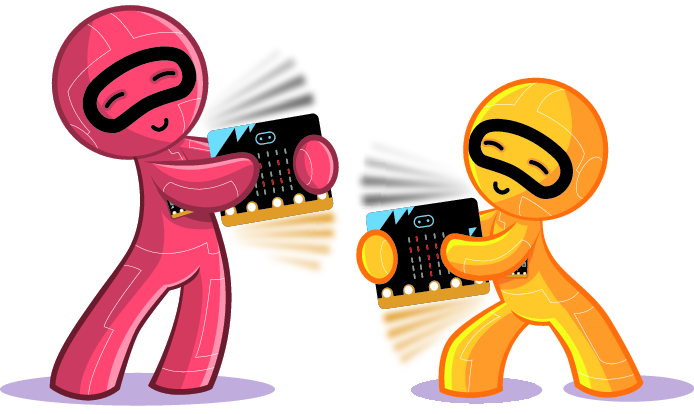
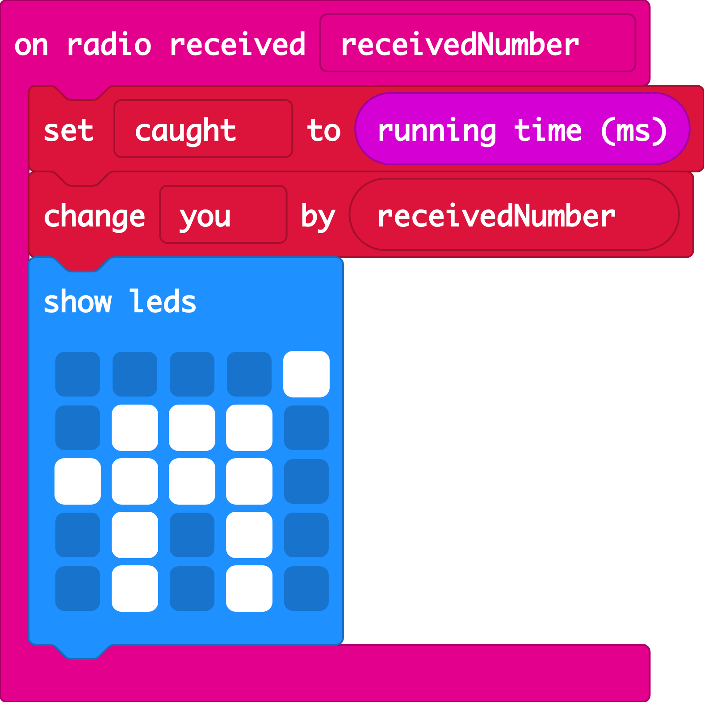
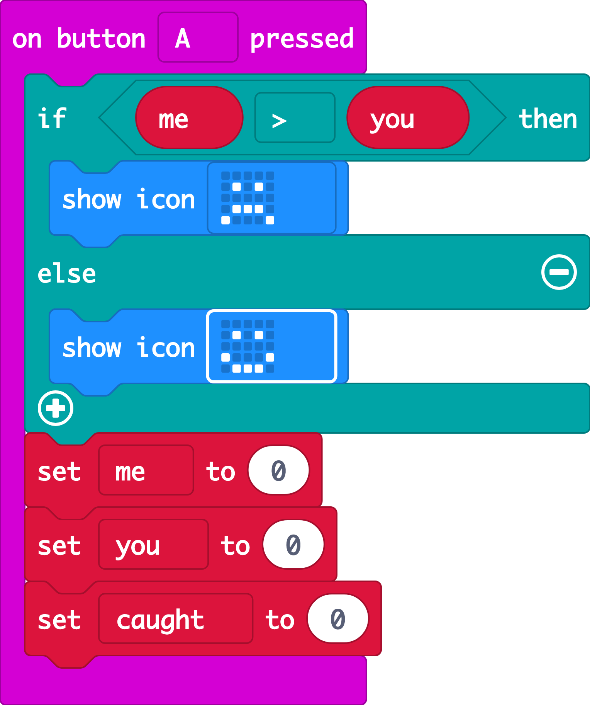

Game 1: Shakey Donkey
=====================

Introduction
------------

Let’s put everything you have learnt so far into practice with a fun
game. If you have not already seen it, Shakey Donkey is a micro:bit game
that uses the radio [^1].

Shakey Donkey is played with two players, and it measures how fast you
react to a Donkey appearing in your micro:bit. The game starts with
shaking micro:bits. The moment your micro:bit displays a Donkey, you
should shout “Donkey!” and shake your micro:bit to make it disappear. At
the end, when you press the button A, if your micro:bit displays a happy
face, you won!

In this chapter, you will practice:

1. the concept of *group communication*

2. using *group* or *multicast address*

3. sending and receiving messages

4. shake and button inputs

5. program variables and random numbers

### What you’ll need

    2 micro:bits
    1 whiteboard/board
    boardmarkers/post-it notes
    1 teammate

Programming: Playing Shakey Donkey
----------------------------------

**Description:** To be able to play this game in groups of 2, you will
set a unique group ID for your pair. Then you will program the Shakey
Donkey game given to you in three parts in the
the following figures.

**Instruction:** To set your groups, repeat the activity from
[Group communication: One to Many](../groupcommunication). Make sure your group IDs are unique!

The game is played by shaking your micro:bit each time the donkey
appears on your display to get rid of it. So, first thing to do is to
program what your micro:bit should do “On shake”. This is shown in
the  figure below.

Notice that, in this first part, your program sends a number. So, you
need a piece of code for handling a received number. This second part is
shown in the next figure. Add it to your JavaScript Blocks editor program.

The third part, shown in the next figure, handles the
case when the button A is pressed. This part of the program decides
whether you won or not. Add this part into your program too.

Download the program into your micro:bits. Play the Shakey Donkey game
with your teammate. Then, go through the problems to explain how your
program works.

Problems
--------

Let’s first look at Part 1, in the first figure.

1. At the beginning, what is the value of the "caught" variable for both players? Does anybody need to change the "me" variable?

2. Who gets to send their "me" variable first?

Next, let’s look at Part 2, in the second figure.

1. When you receive a number, you set the "caught" variable. What does the "caught" variable mean?

2. You also change the "you" variable by the "receivedNumber". What does the "you" variable track?

Now, let’s look at both Parts 1 and 2.

1. Imagine you already started playing the program. You saw some donkeys appear on your display, and you shook them away. How did your "me" variable change? What is it equal to?

Finally, let’s look at Part 3, in the last figure.

1. How do you know you won? Does the other player know the result? How? Explain how the "me" and "you" variables are used to decide the winner.

2. How would you make sure you win this game?

[^1]: This game is by David Whale. We thank him for allowing us to use
    it in this book.
