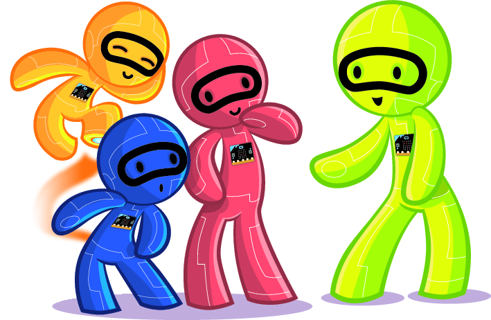
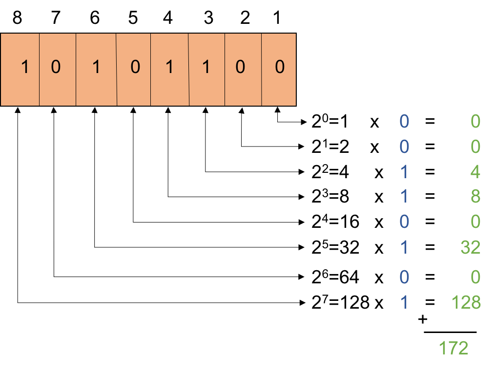

Group communication: One to Many 
================================

Introduction
------------

In the previous chapter, you experimented with broadcast: sending
messages to everybody. In this chapter, you will learn about sending a
message so that it just goes to a smaller group of people. This is an
activity that is best carried out with a large group of friends or class
mates so that you can experiment with different groups and group sizes.

Group communication (also known as multicast) is an interesting concept,
and enables several of today’s Internet technologies. For
example, it enables to send videos as fast as possible over the
Internet. In this chapter, you will learn:

- The concept of *group communication* and *group* or *multicast
    address*

- When group communication is useful and when it isn’t

### What you’ll need

    2 micro:bits
    1 whiteboard/board
    boardmarkers/post-it notes
    1 teammate

Background
----------

In the previous chapter, all micro:bits received messages from all the
other micro:bits. This might have got confusing (or amusing!). Now,
let’s try limiting who you can send messages to and receive messages
from. This is called group communication. Group communication is used in
the Internet to send to many people at the same time. For example,
Internet television and videoconferencing use group communication.

*Definition 1* \[Group communication\] In group communication or multicast, a message
is sent only to the computers in the group.

For this, the messages need to be labeled with a *group* or *multicast
address*.

*Definition 2* \[Group address\] A group or multicast address is a special address
which says all devices in the group should receive this message.

To set a group address (or group ID), you will again use the “radio set group”
block under the Radio menu like in [Broadcast communication:One to all](../../chapter_02). The main challenge of this chapter is creating the groups for communication. How do computers learn about and join these groups?
What happens when they leave a group? In this chapter, you will have a chance to think about these questions when you experiment with creating groups.

### **Further reading**

When configuring group IDs for micro:bits, you will notice that the group IDs range from 0 to 255. This is the decimal (base 10) representation of group IDs. But we can also write these group IDs in binary (base 2). For the binary case, we will need 8 bits to get to a maximum group ID of 255.

Let’s think about the binary representation of group IDs.
The figure below shows an example for the group ID 172 in 8
bits: 10101100. Notice that, we start reading bits from right to left.
Each bit is numbered 1 to 8, corresponding to a power of two. The
leftmost bit, bit 1, means $2^0 = 1$. Bit 2 means $2^1 = 2$ and we
continue like this until we reach bit 8, which means $2^7 = 128$. Each
bit location may contain either 0 or 1. To find the decimal value of
10101100, we need to do some maths. For a bit location $x$, we multiply its
bit value with $2^{x-1}$. For bit
location 8, the bit value is 1, and we need to multiply $2^(8-1) =2^7=128$ with 1.
After doing this for all bit locations, we add all the values we found.
The result of this addition is 172. Now, check for the case 11111111. Is
it really equal to 255? For further reading, see the BBC Bitesize,
Binary revision page in the Resources section.

Programming: Creating groups and messaging within groups
--------------------------------------------------------

In this chapter, you need to work together in pairs or small groups,
with at least 2 micro:bits in each group. You will complete two tasks to
program your micro:bits to send messages to and receive messages within
your group.

### Task 1: Create groups

**Description:** In this task, you will choose a unique group ID for
your group, and configure your radios with this group ID. You will
use the radio block *radio set group* in your program in the JavaScript
Blocks editor. When
choosing group IDs, you have to think about the best way to choose
this number. **Hint: What would happen if two groups choose the same
number, and how would you make sure that doesn’t happen?**

**Instruction:** Use the board and post-it notes to choose a group
ID. Make sure your group ID is not the same as any other group ID

### Task 2: Send and receive messages

**Description:** You will use the programs from the previous chapter to
send and receive messages to your group. You will change these programs
to count the number of messages you receive. This way, you will test
whether you receive messages that only come from your group.

**Instruction:** Write a sender program that sends a random number
between 0 and 9, when you press the button A. Write a receiver program
that increments a counter each time it receives a number. When you press
the button A at the receiver, it displays the value of the counter. With
your group, test that you are receiving the correct number of messages.
Test together with other groups that you are not receiving their
messages.

Extended activity
-----------------

1. How easy or difficult would it be if micro:bits could create groups automatically themselves? How would they pick a group ID? How would they make sure nobody else had that number? Would broadcast be useful? Discuss with your teammates.

2. Can a micro:bit be part of two groups or more? How would you program your micro:bit to do that?

Problems
--------

1. Fill in the blank in this sentence: “A one-to-may communication between one sender and a group of receivers is *---* communication.”

    1. unicast

    2. multicast

    3. broadcast

    4. none of the above

2. Let’s assume the group ID is 3 bits. For example, 010 is a group ID. What is the maximum number of groups can you have in a network?

3. If the group ID were 6 bits,  what is the largest group ID you could choose for your micro:bit?

4. “Compared to broadcast, the receivers in group communication receive more messages.” True or False?

Resources
---------

BBC Bitesize, Binary revision -
<http://www.bbc.co.uk/education/guides/z26rcdm/revision>
