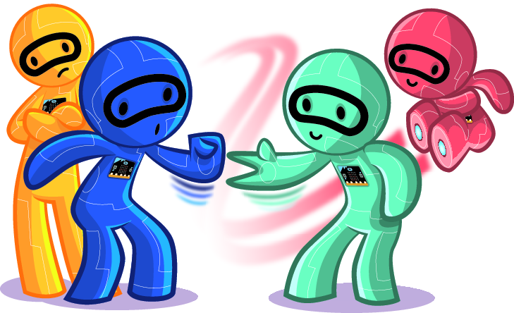
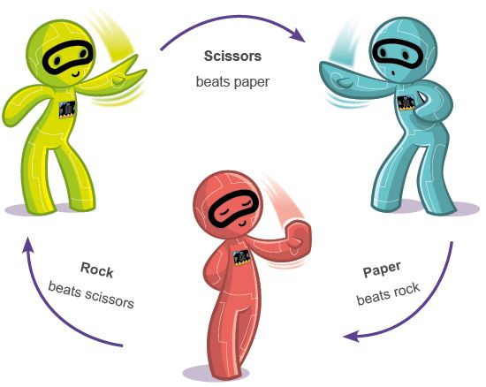

Game 2: Rock, paper, scissors over the radio
============================================



Introduction
------------

Let’s play a game of rock, paper, scissors! Rock, paper and scissors is
a game played with two players. Each player, at the same time, forms one
of the three shapes (rock, paper or scissor) with their hands. Then,
they use these rules to decide who wins:

- The rock crushes the scissors.

- The scissors cuts the paper.

- The paper covers the rock.

- If both players choose the same shape, it is a tie.

Figure below shows these rules.



!!! note ""
	**Figure 1:** Rock paper scissors game: Rock beats Scissors. Scissors beats Paper. Paper beats Rock

In this chapter, you will program this game using your micro:bits. Doing
so, you will practice:

- *Unicast communication*

- Programming with variables

- Programming with conditionals

### What you’ll need

    2 micro:bits
    1 whiteboard/board
    boardmarkers/postit notes
    1 teammate

Programming: Rock, paper, scissors
----------------------------------

To program this game, it is best to work with a teammate. Task 1 is for
familiarising you with the game and will not use the radio. Starting
from Task 2, you will start writing the parts of your program to play
this game over the radio.

### Task 1: Start with the simple game

**Description:** To familiarize yourself with the game, try the
[Rock-Paper-Scissors activity](https://makecode.microbit.org/projects/rock-paper-scissors).
Notice that the program gives a number to *rock*, *paper* and
*scissors*. For example, paper=1, rock=2, and scissors=3.

**Instruction:** Program the code shown on the Rock-Paper-Scissors
activity page, and download it to your micro:bits. Play the game with a
friend. You will each shake your micro:bits at the same time and then
decide who wins using the games rules as described above.

### Task 2: Hand shapes over the radio with unicast

**Description:** To play the game over the radio, you will use the button A to select paper, rock or scissors.  You will use button B to confirm your
selection and send it over the radio. Like in Task 1, use paper=0, rock=1, scissors=2.

**Instruction:** Write a program to do the following:

1. Use button A to select paper, rock or scissors. Each time you press button A, it should alternately show an icon of either paper, rock or scissors.

2. Use button B to confirm your selection, and unicast it to your friend’s micro:bit over the radio like you did in [Unicast Communication: One to One](../unicast/unicast.md).

3. Add code for receiving a number. When you receive a number, show the corresponding icon  on the display. For example, if you received 0, display the paper icon. 

Test with your teammate that you can send and receive your hand shape values over the radio.

### Task 3: Fill the table of rules

**Description:** Your program, when it receives a number from your
teammate’s micro:bit, decides who wins.

**Instruction:** To decide who
wins, compare the number you picked with the number you received. We
provided an incomplete table below to help you decide the result [^2]. Using this table, you
compare *My hand* to *Opponent's hand*. For example, if both of these
numbers mean *Paper*, it is a tie, and the result is a surprised face.
But, if *My hand* is for *Paper* and the *Opponent's hand* is for
*Scissors*, the result is a sad face. In contrast, if *My hand* is
for *Scissors* and the *Opponent's hand* is for *Paper*, then the result
is a happy face. Using the rules of the game, fill the rest of the table.


!!! note ""
	**Figure 2:** Incomplete rock, paper, scissors table
	
### Task 4: Play the game

**Description:** Once you filled the table, you need to decide how to
program these rules in your code. Your program will:

1. play the game based on Rock-Paper-Scissors rules

2. display a *happy* face if you won, a *sad* face if you lost. And if it’s a draw, show a *surprised* face.

**Instruction:** Figure below shows a
template for programming the table using the *if* block in the JavaScript Blocks editor
*Logic* menu. Note that this is just a template and it is there to give
you an idea of the structure of your program. For instance, your *on radio received* block will have to be different to do unicast communication (see [Unicast Communication: One to One](../unicast/unicast.md)).

You will notice in the template that we used two variables: *selected* and *received*.
*selected* is set to *True* when you make the selection for your hand by pressing button B. *received* is set to *True* when you receive your opponent’s hand. In the *forever* block,
the game is only played when both *selected* and *received* are *True*. Once you enter the block to play the game, these variables are initialized to *False* for the next round.

After you program the game, play it with your teammate! Who
wins more often?

```blocks
let my_hand = 0
let selected = false
input.onButtonPressed(Button.B, function () {
    selected = true
    radio.sendNumber(my_hand)
})
```
```blocks
let opponent_hand = 0
let received = false
radio.onReceivedNumber(function (receivedNumber) {
    received = true
    opponent_hand = receivedNumber
})
```
```blocks
let my_hand = 0
let opponent_hand = 0
let received = false
let selected = false
basic.forever(function () {
    if (selected == true && received == true) {
        selected = false
        received = false
        if (opponent_hand == my_hand) {
            basic.showIcon(IconNames.Surprised)
        } else {
            if (my_hand == 0 && opponent_hand == 1) {
                basic.showIcon(IconNames.Happy)
            } else if (0 == 0) {
            	
            } else if (0 == 0) {
            	
            } else {
            	
            }
        }
    }
})
```

!!! note ""
	**Figure 3:** Rock paper scissors: A template for programming the rules
	
Exercises
---------

!!! attention "Exercise 1"
	How might you expand your program to play rock/paper/scissors/lizard/spock? 
	To learn more about this extension check the website: [http://www.samkass.com/theories/RPSSL.html](http://www.samkass.com/theories/RPSSL.html).

Problems
--------

1. How do you test a tie in your program?

2. How does the Table change, if paper=2, rock=0, and scissors=1? Redraw your table.

3. To play with a different player, what do you need to change in your program? Remember you are using unicast to send your hand shape.

4. What happens if you send your hand shape to the other player before they pick theirs? Will there be a problem? Could they cheat!?

Resources
---------

- Flash game: Rock-Paper-Scissors: You vs. the Computer -
    <http://www.nytimes.com/interactive/science/rock-paper-scissors.html>

